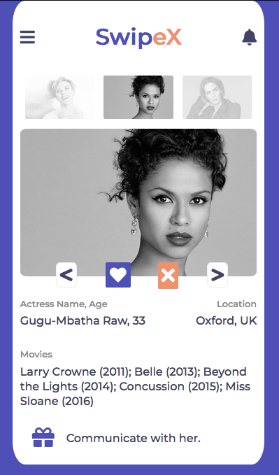

# SwipeX

A mobile dating app!

This is a capstone project that demonstrates the ability to build and customize a HTML/CSS page from a UX design and stylistic template.

## Built With

- HTML5
- CSS3

## Live Demo

[Live Demo Link](https://raw.githack.com/paulo-techie/swipeX/feature-main/index.html)

###  Prerequisites
  - Have any browser that supports HTML5 and CSS#
### Install
  - With the browser set, you do not need to install any other thing
  - Clone the files to your local drive.
### . Usage
  - Open the index.html file and you are good to go.
## Authors
  - 

👤 Paul Omondi

- Github: [@paulo-techie](https://github.com/paulo-techie)
- Linkedin: [paul-o-43051a31](https://www.linkedin.com/in/paul-o-43051a31)

## 🤝 Contributing

Contributions, issues and feature requests are welcome!

Feel free to check the [issues page](https://github.com/paulo-techie/The-Next-Web/issues).

## Show your support

Give a ⭐️ if you like this project!

## 📝 License

This project is [MIT](lic.url) licensed.
